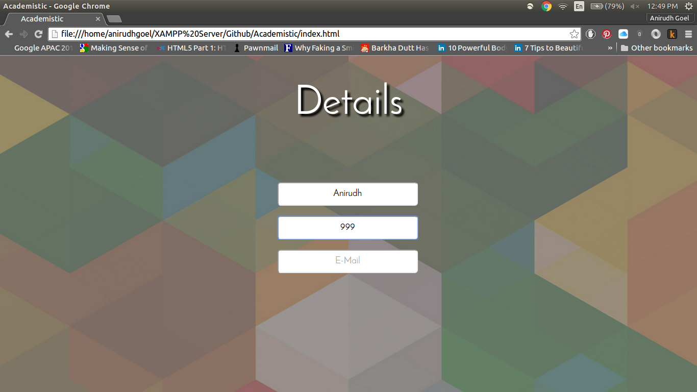
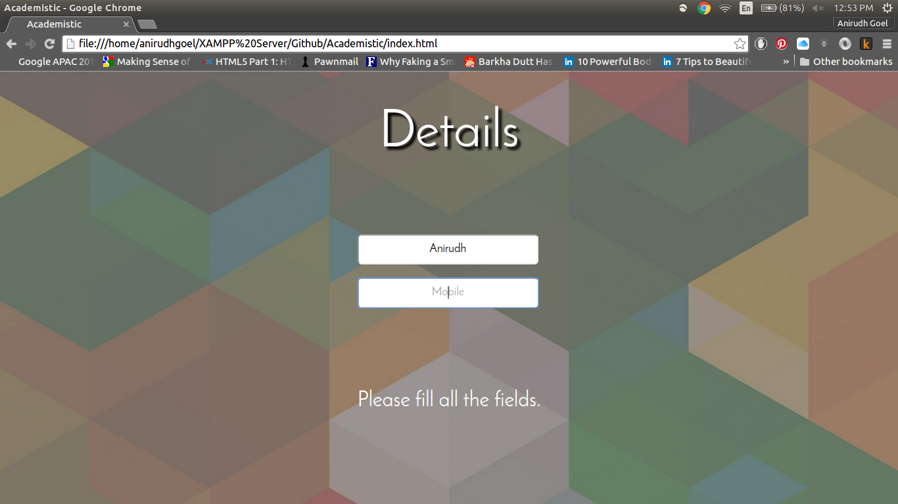

# Academistic

There are 3 text fields to get the details from user. The details are accepted using jQuery AJAX. A PHP script mails the details to my Email ID.

# Interaction Features

The project has beautiful animations for user ease. Initially only a "Name" input field appears, as the user enters the name, a "Mobile" field appears and when she/he starts entering the mobile number, an "Email" field appears followed by a "Submit" button as user enters the email address. If the user tries to submit the data anywhere in between with the enter key, without filling in all the details an error message is generated. Screenshots for all these features are given below-

 
 
 
 

If user tries pressing "Enter" key without submitting all the details.

